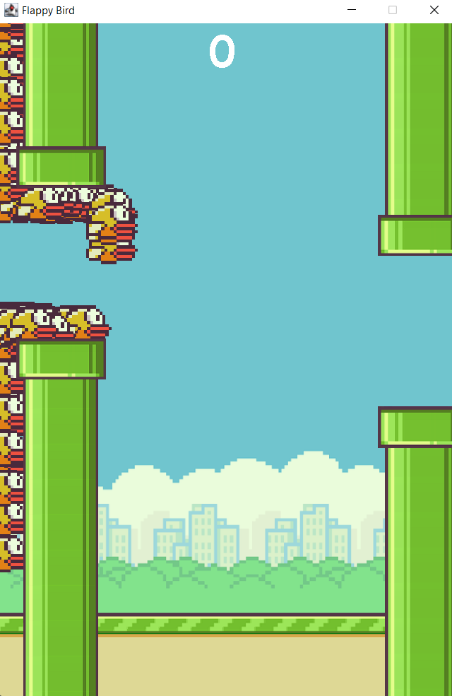
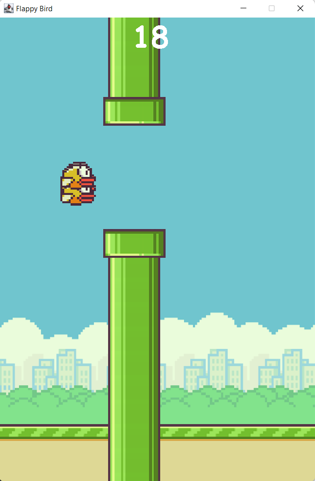

Flappy Bird with NEAT algorithm

The original game : https://flappybird.io/
(Images come from here)

NEAT Algorithm paper : http://nn.cs.utexas.edu/downloads/papers/stanley.cec02.pdf

Hidden layer of 0 to 3 nodes.
More hidden node can be added via mutations. 
It is able to play on very hard difficulty, which is too hard for human (height between pipes is lower than jump height)
